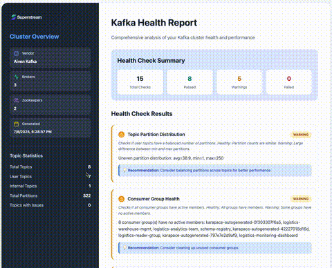

# Superstream Kafka Analyzer

[](https://nodejs.org/)
[](LICENSE)
[](package.json)



Interactive CLI for analyzing Kafka health and configuration according to best practices and industry standards.

Made with ❤️ by the [Superstream](https://superstream.ai) Team

## 📚 Table of Contents

- [Features](#-features)
- [Prerequisites](#-prerequisites)
- [Installation](#-installation)
- [Quick Start](#-quick-start)
- [Configuration File Examples](#configuration-file-examples)
- [Email Collection](#email-collection)
- [Output Formats](#output-formats)
- [Health Checks](#-health-checks)
- [Required Permissions](#-required-permissions)
- [Analytics & Location Tracking](#-analytics--location-tracking)
- [Validation Process](#-validation-process)
- [Output Structure](#-output-structure)
- [Development](#-development)
- [Testing](#-testing)
- [Configuration Reference](#-configuration-reference)
- [Troubleshooting](#-troubleshooting)
- [License](#-license)
- [Contributing](#-contributing)
- [Support](#-support)

## 🚀 Features

- **Interactive CLI Interface** - User-friendly prompts for configuration
- **Configuration File Support** - Load settings from JSON config files
- **Multi-Layer Validation** - Comprehensive connection and security testing
- **Security Protocol Support** - PLAINTEXT, SSL/TLS, SASL, and OIDC authentication
- **Multiple Output Formats** - JSON, CSV, HTML, and TXT reports
- **Real-time Progress** - Visual feedback during analysis
- **Error Handling** - Detailed troubleshooting information
- **Cross-platform** - Works on Windows, macOS, and Linux

## 📋 Prerequisites

- Node.js 16.0.0 or higher
- Access to a Kafka cluster

## 🛠️ Installation

No installation required! Run directly with npx:

```bash
npm install -g superstream-kafka-analyzer
```

## 🎯 Quick Start

### Interactive Mode

```bash
# Interactive mode (recommended for first-time users)
npx superstream-kafka-analyzer
```

### Configuration File Mode

```bash
# Using a configuration file
npx superstream-kafka-analyzer --config config.json
```

### Configuration File Examples

**Available Examples:**
The full list is under the `./config-examples/` folder:
- [Basic Configuration](config-examples/config.example.json) - Simple localhost setup
- [SASL Authentication](config-examples/config.example.sasl.json) - Generic SASL setup
- [Apache Kafka](config-examples/config.example.apache-kafka.json) - Apache Kafka with SASL
- [Apache Kafka (Plaintext)](config-examples/config.example.apache-kafka-plaintext.json) - Apache Kafka without authentication
- [Apache Kafka (SCRAM)](config-examples/config.example.apache-kafka-scram.json) - Apache Kafka with SCRAM authentication
- [AWS MSK (IAM)](config-examples/config.example.aws-msk-iam.json) - AWS MSK with IAM authentication
- [AWS MSK (SCRAM)](config-examples/config.example.aws-msk.json) - AWS MSK with SCRAM authentication
- [Confluent Cloud](config-examples/config.example.confluent-cloud.json) - Confluent Cloud setup
- [Confluent Platform](config-examples/config.example.confluent-platform.json) - Confluent Platform setup
- [Aiven Kafka](config-examples/config.example.aiven-kafka-ssl.json) - Aiven Kafka with SSL authentication
- [Aiven Kafka](config-examples/config.example.aiven-kafka-sasl.json) - Aiven Kafka with SASL SSL authentication
- [Redpanda](config-examples/config.example.redpanda.json) - Redpanda setup
- [OIDC Authentication](config-examples/config.example.oidc.json) - OpenID Connect authentication
- [Azure AD OAuth](config-examples/config.example.azure-ad-oauth.json) - Azure Active Directory
- [Keycloak OAuth](config-examples/config.example.keycloak-oauth.json) - Keycloak OIDC
- [Okta OAuth](config-examples/config.example.okta-oauth.json) - Okta OIDC
- [Auth0 OIDC](config-examples/config.example.auth0-oidc.json) - Auth0 authentication
- [Generic OAuth](config-examples/config.example.generic-oauth.json) - Generic OAuth provider
- [With Timestamp](config-examples/config.example.with-timestamp.json) - Include timestamp in filenames
- [Without Timestamp](config-examples/config.example.without-timestamp.json) - No timestamp in filenames

**Basic Configuration** (`config.example.json`):
```json
{
  "kafka": {
    "bootstrap_servers": "localhost:9092",
    "clientId": "superstream-analyzer",
    "vendor": "apache",
    "useSasl": false
  },
  "file": {
    "outputDir": "./kafka-analysis",
    "formats": ["html"],
    "includeMetadata": true,
    "includeTimestamp": true
  },
  "email": "user@example.com"
}
```

**SASL Authentication** (`config.example.sasl.json`):
```json
{
  "kafka": {
    "bootstrap_servers": ["kafka1.example.com:9092", "kafka2.example.com:9092", "kafka3.example.com:9092"],
    "clientId": "superstream-analyzer",
    "vendor": "apache",
    "useSasl": true,
    "sasl": {
      "mechanism": "PLAIN",
      "username": "your-username",
      "password": "your-password"
    }
  },
  "file": {
    "outputDir": "./kafka-analysis",
    "formats": ["html"],
    "includeMetadata": true,
    "includeTimestamp": true
  },
  "email": "user@example.com"
}
```

**AWS MSK with SCRAM** (`config.example.aws-msk.json`):
```json
{
  "kafka": {
    "bootstrap_servers": ["b-1.your-cluster.abc123.c2.kafka.us-east-1.amazonaws.com:9092"],
    "clientId": "superstream-analyzer",
    "vendor": "aws-msk",
    "useSasl": true,
    "sasl": {
      "mechanism": "SCRAM-SHA-512",
      "username": "your-msk-username",
      "password": "your-msk-password"
    }
  },
  "file": {
    "outputDir": "./kafka-analysis",
    "formats": ["html"],
    "includeMetadata": true,
    "includeTimestamp": true
  },
  "email": "user@example.com"
}
```

**AWS MSK with IAM** (`config.example.aws-msk-iam.json`):
```json
{
  "kafka": {
    "bootstrap_servers": ["b-1.your-cluster.abc123.c2.kafka.us-east-1.amazonaws.com:9198"],
    "clientId": "superstream-analyzer",
    "vendor": "aws-msk",
    "useSasl": true,
    "sasl": {
      "mechanism": "oauthbearer"
    }
  },
  "file": {
    "outputDir": "./kafka-analysis",
    "formats": ["html"],
    "includeMetadata": true,
    "includeTimestamp": true
  },
  "email": "user@example.com"
}
```

**Confluent Cloud** (`config.example.confluent-cloud.json`):
```json
{
  "kafka": {
    "brokers": ["pkc-xxxxx.region.cloud:9092"],
    "clientId": "superstream-analyzer",
    "vendor": "confluent-cloud",
    "useSasl": true,
    "sasl": {
      "mechanism": "PLAIN",
      "username": "your-api-key",
      "password": "your-api-secret"
    }
  },
  "file": {
    "outputDir": "./kafka-analysis",
    "formats": ["html"],
    "includeMetadata": true,
    "includeTimestamp": true
  },
  "email": "user@example.com"
}
```

> **Note**: Confluent Cloud connections now use the official Confluent Cloud methodology with `@confluentinc/kafka-javascript` library, SASL_SSL protocol, and PLAIN mechanism as recommended by Confluent.

**Aiven Kafka** (`config.example.aiven-kafka.json`):
```json
{
  "kafka": {
    "brokers": ["kafka-xxxxx-aiven-kafka.aivencloud.com:12345"],
    "clientId": "superstream-analyzer",
    "vendor": "aiven",
    "useSasl": false,
    "ssl": {
      "ca": "path/to/ca.pem",
      "cert": "path/to/service.cert",
      "key": "path/to/service.key"
    }
  },
  "file": {
    "outputDir": "./kafka-analysis",
    "formats": ["json", "csv", "html", "txt"],
    "includeMetadata": true,
    "includeTimestamp": true
  },
  "email": "user@example.com"
}
```

```json
{
  "kafka": {
    "bootstrap_servers": ["your-aiven-cluster.aivencloud.com:12345"],
    "clientId": "superstream-analyzer",
    "vendor": "aiven",
    "useSasl": true,
    "sasl": {
      "mechanism": "scram-sha-256",
      "username": "avnadmin",
      "password": "*********"
    },
    "ssl": {
      "ca": "./certs/ca.pem"
    }
  },
  "file": {
    "outputDir": "./kafka-analysis",
    "formats": ["html"],
    "includeMetadata": true,
    "includeTimestamp": true
  },
  "email": "user@example.com"
}
```

## 🔧 Command Line Options

| Option | Description | Default |
|--------|-------------|---------|
| `--config <path>` | Path to configuration file | - |

## 🔐 Security Protocols

### PLAINTEXT (No Security)
```bash
# Default for local development
npx superstream-kafka-analyzer
# Configure bootstrap servers as: localhost:9092
```

### SASL Authentication
```bash
# With SASL credentials
npx superstream-kafka-analyzer
# Configure SASL mechanism and credentials when prompted
```

### OIDC Authentication (OpenID Connect)
The analyzer supports modern OIDC authentication with any OIDC-compliant identity provider including Azure AD, Keycloak, Okta, Auth0, and others.

```bash
# With OIDC authentication
npx superstream-kafka-analyzer --config config-oidc.json
```

**Key Features:**
- **Auto-discovery**: Automatically discovers OIDC endpoints using well-known discovery documents
- **Token validation**: Optional JWT token validation using JWKS
- **Multiple grant types**: Support for `client_credentials`, `password`, and `authorization_code` flows
- **Token caching**: Automatic token caching to reduce authentication overhead
- **Vendor-specific presets**: Built-in configurations for popular providers

**Quick Example:**
```json
{
  "kafka": {
    "brokers": ["kafka.example.com:9093"],
    "vendor": "oidc",
    "useSasl": true,
    "sasl": {
      "mechanism": "oauthbearer",
      "discoveryUrl": "https://auth.example.com/.well-known/openid-configuration",
      "clientId": "your-client-id",
      "clientSecret": "your-client-secret",
      "scope": "openid kafka:read",
      "grantType": "client_credentials"
    }
  }
}
```

📚 **For detailed OIDC setup instructions, see:**
- **[OIDC Authentication Guide](config-examples/OIDC-AUTH-GUIDE.md)** - Complete setup guide with examples for all major providers
- **[Configuration Examples](config-examples/README.md)** - Vendor-specific configuration templates

## 📊 Analysis Report

The tool generates comprehensive reports including:

### Cluster Information
- ZooKeepers details
- Broker information (host, port, rack)
- Analysis timestamp

### Topic Analysis
- Total topics and partitions
- User vs internal topics
- Replication factor distribution
- Topic configurations
- Error detection

### Output Formats

#### JSON Format
Complete structured data including all cluster and topic information.

📄 **[View Example JSON Report](report-examples/kafka-report.json)**

#### CSV Format
Tabular data for easy analysis in spreadsheet applications.

#### HTML Format
Beautiful formatted report with responsive design and styling.

📄 **[View Example HTML Report](report-examples/kafka-report.html)**

#### TXT Format
Simple text summary for quick review.

📄 **[View Example TXT Report](report-examples/kafka-report.txt)**

## 🔍 Health Checks

The tool performs comprehensive health checks on your Kafka cluster to identify potential issues and provide recommendations:

### AWS MSK Health Checks
- **Replication Factor vs Broker Count**: Ensures topics don't have replication factor > broker count
- **Topic Partition Distribution**: Checks for balanced partition distribution across topics
- **Consumer Group Health**: Identifies consumer groups with no active members
- **Internal Topics Health**: Verifies system topics are healthy
- **Under-Replicated Partitions**: Checks if topics have fewer in-sync replicas than configured
- **Min In-Sync Replicas Configuration**: Checks if topics have min.insync.replicas > replication factor
- **AWS MSK Specific Health**: Checks MSK system topics (__amazon_msk_*, __consumer_offsets)
- **Rack Awareness**: Verifies rack awareness configuration for better availability
- **Replica Distribution**: Ensures replicas are evenly distributed across brokers
- **Metrics Configuration**: Checks Open Monitoring (port 11001) accessibility
- **Logging Configuration**: Verifies LoggingInfo configuration via AWS SDK
- **Authentication Configuration**: Detects if unauthenticated access is enabled (security risk)
- **Quotas Configuration**: Checks if Kafka quotas are configured and being used
- **Payload Compression**: Checks if payload compression is enabled on user topics
- **Infinite Retention Policy**: Checks if any topics have infinite retention policy enabled
- **Unclean Leader Election**: Detects if unclean.leader.election.enable is true
- **ACL Enforcement**: Verifies authorizer.class.name and allow.everyone.if.no.acl.found settings
- **Auto Topic Creation**: Detects if auto.create.topics.enable is true
- **Message Size Consistency**: Validates message.max.bytes < replica.fetch.max.bytes < fetch.max.bytes
- **Default Topic Replication**: Verifies default.replication.factor >= 3
- **Controlled Shutdown**: Validates controlled.shutdown.* settings
- **Consumer Lag Threshold**: Flags groups exceeding lag threshold
- **Dead Consumer Groups**: Detects groups in DEAD state
- **Single-Partition High Throughput**: Flags 1-partition topics > 1MB/s

### Confluent Cloud Health Checks
- **Topic Partition Distribution**: Checks for balanced partition distribution across topics
- **Consumer Group Health**: Identifies consumer groups with no active members
- **Internal Topics Health**: Verifies system topics are healthy
- **Under-Replicated Partitions**: Checks if topics have fewer in-sync replicas than configured
- **Logging Configuration**: Confirms built-in logging availability
- **Authentication Configuration**: Detects if unauthenticated access is enabled (security risk)
- **Quotas Configuration**: Checks if Kafka quotas are configured and being used
- **Payload Compression**: Checks if payload compression is enabled on user topics
- **Infinite Retention Policy**: Checks if any topics have infinite retention policy enabled
- **ACL Enforcement**: Uses Confluent Cloud API to analyze ACLs for overly permissive rules (requires API credentials)
- **Consumer Lag Threshold**: Flags groups exceeding lag threshold
- **Dead Consumer Groups**: Detects groups in DEAD state
- **Single-Partition High Throughput**: Flags 1-partition topics > 1MB/s

### Aiven Kafka Health Checks
- **Replication Factor vs Broker Count**: Ensures topics don't have replication factor > broker count
- **Topic Partition Distribution**: Checks for balanced partition distribution across topics
- **Consumer Group Health**: Identifies consumer groups with no active members
- **Internal Topics Health**: Verifies system topics are healthy
- **Under-Replicated Partitions**: Checks if topics have fewer in-sync replicas than configured
- **Min In-Sync Replicas Configuration**: Checks if topics have min.insync.replicas > replication factor
- **Rack Awareness**: Checks rack awareness configuration for better availability
- **Replica Distribution**: Ensures replicas are evenly distributed across brokers
- **Logging Configuration**: Confirms built-in logging availability
- **Authentication Configuration**: Detects if unauthenticated access is enabled (security risk)
- **Quotas Configuration**: Checks if Kafka quotas are configured and being used
- **Payload Compression**: Checks if payload compression is enabled on user topics
- **Infinite Retention Policy**: Checks if any topics have infinite retention policy enabled
- **Auto Topic Creation**: Detects if auto.create.topics.enable is true
- **Message Size Consistency**: Validates message.max.bytes < replica.fetch.max.bytes < fetch.max.bytes
- **Controlled Shutdown**: Validates controlled.shutdown.* settings
- **Consumer Lag Threshold**: Flags groups exceeding lag threshold
- **Dead Consumer Groups**: Detects groups in DEAD state
- **Single-Partition High Throughput**: Flags 1-partition topics > 1MB/s
- **ACL Enforcement**: Verifies authorizer and allow_everyone_if_no_acl_found equivalents

### Generic Kafka Health Checks
- **Replication Factor vs Broker Count**: Ensures topics don't have replication factor > broker count
- **Topic Partition Distribution**: Checks for balanced partition distribution across topics
- **Consumer Group Health**: Identifies consumer groups with no active members
- **Internal Topics Health**: Verifies system topics are healthy
- **Under-Replicated Partitions**: Checks if topics have fewer in-sync replicas than configured
- **Min In-Sync Replicas Configuration**: Checks if topics have min.insync.replicas > replication factor
- **Rack Awareness**: Checks rack awareness configuration for better availability
- **Replica Distribution**: Ensures replicas are evenly distributed across brokers
- **Metrics Configuration**: Verifies JMX/metrics exposure in broker metadata
- **Logging Configuration**: Checks logging configuration
- **Authentication Configuration**: Detects if unauthenticated access is enabled (security risk)
- **Quotas Configuration**: Checks if Kafka quotas are configured and being used
- **Payload Compression**: Checks if payload compression is enabled on user topics
- **Infinite Retention Policy**: Checks if any topics have infinite retention policy enabled
- **Unclean Leader Election**: Detects if unclean.leader.election.enable is true
- **ACL Enforcement**: Verifies authorizer.class.name and allow.everyone.if.no.acl.found settings
- **Auto Topic Creation**: Detects if auto.create.topics.enable is true
- **Message Size Consistency**: Validates message.max.bytes < replica.fetch.max.bytes < fetch.max.bytes
- **Default Topic Replication**: Verifies default.replication.factor >= 3 (when broker count ≥ 3)
- **Controlled Shutdown**: Validates controlled.shutdown.* settings
- **Consumer Lag Threshold**: Flags groups exceeding lag threshold
- **Dead Consumer Groups**: Detects groups in DEAD state
- **Single-Partition High Throughput**: Flags 1-partition topics > 1MB/s

### Health Check Status
- ✅ **Pass**: Configuration is healthy and optimal
- ⚠️ **Warning**: Configuration could be improved for better performance/security
- ❌ **Failed**: Critical issue that should be addressed
- ℹ️ **Info**: Informational message with recommendations

## 🔍 Validation Process

The tool performs comprehensive validation in multiple phases:

### Phase 1: Input Format Validation
- Broker URL format validation
- File system permissions
- Output directory creation

### Phase 2: Network Connectivity Testing
- DNS resolution verification
- TCP connection testing
- Kafka cluster connectivity

### Phase 3: Security Protocol Testing
- SASL authentication verification
- SSL/TLS certificate validation
- Credential testing

### Phase 4: Complete Setup Validation
- End-to-end connection testing
- File system write permissions
- Output format generation testing

## 📁 Output Structure

```
kafka-analysis/
├── analysis-2024-01-15-14-30-25.json
├── analysis-2024-01-15-14-30-25.csv
├── analysis-2024-01-15-14-30-25.html
└── analysis-2024-01-15-14-30-25.txt
```

## 🛠️ Development

### Project Structure
```
superstream-analyzer/
├── bin/
│   └── index.js          # CLI entry point
├── src/
│   ├── cli.js            # Main CLI logic
│   ├── kafka-client.js   # Kafka connection and analysis
│   ├── file-service.js   # File output handling
│   ├── validators.js     # Validation framework
│   └── utils.js          # Utility functions
├── config.example.json   # Basic configuration example
├── config.example.sasl.json # SASL configuration example
└── package.json
```

### Local Development

```bash
# Clone and install dependencies
git clone <repository>
cd superstream-analyzer
npm install

# Run in development mode
npm run dev

# Test with local Kafka
npm run test:local
```

## 🧪 Testing

### Manual Testing
```bash
# Test with local Kafka cluster
npx . --config config.example.json

# Test with SASL authentication
npx . --config config.example.sasl.json
```

### Validation Testing
The tool includes comprehensive validation that will:
- Test network connectivity
- Verify authentication credentials
- Validate file system permissions
- Generate sample outputs

## 📝 Configuration Reference

### Kafka Configuration
| Field | Type | Required | Description |
|-------|------|----------|-------------|
| `bootstrap_servers` | string | Yes | Comma-separated list of Kafka bootstrap servers |
| `clientId` | string | Yes | Client identifier for Kafka connection |
| `vendor` | string | No | Kafka vendor (aws-msk, confluent-cloud, aiven, etc.) |
| `useSasl` | boolean | No | Enable SASL authentication |
| `sasl.mechanism` | string | No* | SASL mechanism (PLAIN, SCRAM-SHA-256, SCRAM-SHA-512) |
| `sasl.username` | string | No* | SASL username |
| `sasl.password` | string | No* | SASL password |

*Required if `useSasl` is true

### File Configuration
| Field | Type | Required | Description |
|-------|------|----------|-------------|
| `outputDir` | string | Yes | Directory for output files |
| `formats` | array | Yes | Array of output formats (json, csv, html, txt) |
| `includeMetadata` | boolean | No | Include metadata in output files |

### Email Configuration
| Field | Type | Required | Description |
|-------|------|----------|-------------|
| `email` | string | No | Email address for generating report files. If not provided, no file output will be generated |

### Confluent Cloud ACL Analysis (Optional)

For enhanced ACL analysis on Confluent Cloud, provide resource API credentials and your Cluster ID. The REST endpoint is automatically derived from your broker host.

| Field | Type | Required | Where |
|-------|------|----------|-------|
| `confluent.resourceApiKey` | string | No | config file or CLI prompt |
| `confluent.resourceApiSecret` | string | No | config file or CLI prompt |
| `confluent.clusterId` | string | No | config file or CLI prompt |

Notes:
- The REST endpoint is inferred from your first broker in `kafka.brokers` (host portion, without port).
- If credentials are not provided, the Confluent ACL analysis is skipped.

## 🚨 Troubleshooting

### Common Issues

**Missing Vendor Field Error**
- **Error**: "Missing 'vendor' field in kafka configuration"
- **Solution**: Add the appropriate vendor field to your configuration:
  - AWS MSK IAM: `"vendor": "aws-msk"`
  - Confluent Cloud: `"vendor": "confluent-cloud"`
  - Aiven: `"vendor": "aiven"`
  - Apache Kafka: `"vendor": "apache"`
  - Redpanda: `"vendor": "redpanda"`
- **Why**: The vendor field tells the tool how to handle vendor-specific authentication mechanisms

**AWS MSK IAM Authentication Failed**
- **Error**: "Failed to generate auth token" or "authenticationProvider is not a function"
- **Solution**: 
  1. Ensure AWS credentials are properly configured:
     - Set `AWS_ACCESS_KEY_ID` and `AWS_SECRET_ACCESS_KEY` environment variables, OR
     - Include credentials in config file: `"accessKeyId"` and `"secretAccessKey"`
  2. Verify the IAM user has proper MSK permissions
  3. Check that the broker URLs are correct (should use port 9198 for IAM)
  4. Ensure the region matches your MSK cluster
- **Why**: AWS MSK IAM requires valid AWS credentials and proper IAM permissions

**Connection Timeout**
- Verify broker URLs are correct
- Check network connectivity
- Ensure firewall allows connections

**Authentication Failed**
- Verify SASL credentials
- Check SASL mechanism compatibility
- Ensure user has proper permissions

**File System Errors**
- Check write permissions for output directory
- Ensure sufficient disk space
- Verify directory exists and is writable

**Validation Errors**
- Review detailed error logs
- Check all configuration parameters
- Verify Kafka cluster is accessible

### Getting Help

1. Run with verbose logging to see detailed error information
2. Check the validation logs for specific failure points
3. Verify your configuration file format matches the examples
4. Ensure your Kafka cluster is running and accessible

## 📄 License

This project is licensed under the MIT License - see the [LICENSE](LICENSE) file for details.

## 🤝 Contributing

1. Fork the repository
2. Create a feature branch
3. Make your changes
4. Add tests if applicable
5. Submit a pull request

## 📞 Support

For issues and questions:
- Check the troubleshooting section
- Review validation logs for specific errors
- Ensure configuration matches the examples provided
- Email us: team@superstream.ai

## ✅ Health/Configuration Checks

SuperStream Kafka Analyzer performs a comprehensive set of health checks on your Kafka cluster to help you identify issues and optimize your setup:

- **Replication Factor vs Broker Count:** Ensures topics do not have a replication factor greater than the number of brokers.
- **Topic Partition Distribution:** Checks for balanced partition distribution across topics.
- **Consumer Group Health:** Identifies consumer groups with no active members.
- **Internal Topics Health:** Verifies system topics are healthy.
- **Under-Replicated Partitions:** Checks if topics have fewer in-sync replicas than configured.
- **Min In-Sync Replicas Configuration:** Checks if topics have min.insync.replicas greater than replication factor.
- **Vendor-Specific Checks:** For AWS MSK, Confluent, Aiven, and Apache Kafka, checks for system topics and platform-specific best practices.
- **Rack Awareness:** Verifies rack awareness configuration for better availability.
- **Replica Distribution:** Ensures replicas are evenly distributed across brokers.
- **Metrics Configuration:** Checks if monitoring/metrics are properly configured.
- **Logging Configuration:** Verifies logging configuration for your Kafka deployment.
- **Authentication Configuration:** Detects if unauthenticated access is enabled (security risk).
- **Quotas Configuration:** Checks if Kafka quotas are configured and being used.
- **Payload Compression:** Checks if payload compression is enabled on user topics.
- **Infinite Retention Policy:** Checks if any topics have infinite retention policy enabled.
- **Unclean Leader Election:** Detects if unclean.leader.election.enable is true.
- **ACL Enforcement:** Verifies authorizer.class.name and allow.everyone.if.no.acl.found settings.
- **Auto Topic Creation:** Detects if auto.create.topics.enable is true.
- **Message Size Consistency:** Validates message.max.bytes < replica.fetch.max.bytes < fetch.max.bytes.
- **Default Topic Replication:** Verifies default.replication.factor >= 3 (when broker count ≥ 3).
- **Controlled Shutdown:** Validates controlled.shutdown.* settings.
- **Consumer Lag Threshold:** Flags groups exceeding lag threshold.
- **Dead Consumer Groups:** Detects groups in DEAD state.
- **Single-Partition High Throughput:** Flags 1-partition topics > 1MB/s.

Each check provides a clear status (✅ Pass, ⚠️ Warning, ❌ Failed, ℹ️ Info) and actionable recommendations.

## 🔒 Security & Privacy

- **No Data Shared:** All analysis and health checks are performed locally on your machine. No Kafka data, credentials, or cluster information is ever sent to any external server.
- **Local-Only:** The tool does not transmit, store, or share your Kafka messages, topic data, or configuration outside your environment.
- **Optional Analytics:** Anonymous usage analytics (such as error events and feature usage) are sent only if enabled, and never include sensitive Kafka data. You can disable analytics by setting `SUPERSTREAM_ANALYTICS=false`.
- **Email collection:** We're collecting email addresses to help the Superstream team better understand the types of companies using our tool. This insight will guide us in shaping a commercial version that meets real needs. While we're deeply committed to supporting the community, gaining even basic marketing insights is essential for us to justify the time and resources required to sustain and grow this project. Your email address will never be shared, and we don’t believe in cold emails or unsolicited marketing. We only reach out if you’ve clearly opted in or asked.

Your security and privacy are our top priority. Everything runs locally and securely by default.

## 🔑 Required Permissions

To perform all health checks, your user/service account must have the following permissions for each vendor:

### AWS MSK
- **AWS IAM Permissions:**
  - `kafka:DescribeCluster`
  - `kafka:DescribeConfiguration`
  - `kafka:ListClusters`
  - `kafka:ListNodes`
  - (Optional for advanced checks) `kafka:ListConfigurations`, `kafka:ListKafkaVersions`
- **Kafka Permissions:**
  - `Describe` and `List` on all topics and consumer groups
  - `DescribeConfigs` on brokers and topics
  - `Read`/`Consume` on topics (required for consumer group health and producer compression checks)

### Confluent Cloud
- **API Key/Secret Permissions:**
  - `CloudClusterAdmin` or equivalent role
  - `Describe` and `List` on all topics and consumer groups
  - `DescribeConfigs` on brokers and topics
  - `Read`/`Consume` on topics (required for consumer group health and producer compression checks)

### Aiven Kafka
- **Service Account/User Permissions:**
  - `Describe` and `List` on all topics and consumer groups
  - `DescribeConfigs` on brokers and topics
  - `Read`/`Consume` on topics (required for consumer group health and producer compression checks)

### Apache Kafka / Confluent Platform / Redpanda
- **Kafka User Permissions:**
  - `Describe` and `List` on all topics and consumer groups
  - `DescribeConfigs` on brokers and topics
  - `Read`/`Consume` on topics (required for consumer group health and producer compression checks)

> **Note:**
> - Some checks (like logging, quotas, and metrics) require admin-level access to the Kafka Admin API or cloud provider API.
> - For AWS MSK, you must also have valid AWS credentials configured in your environment.
> - If you only have limited permissions, some health checks may be skipped or show warnings.

--- 
